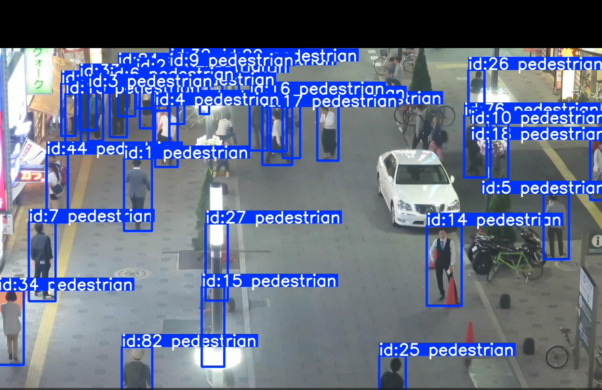
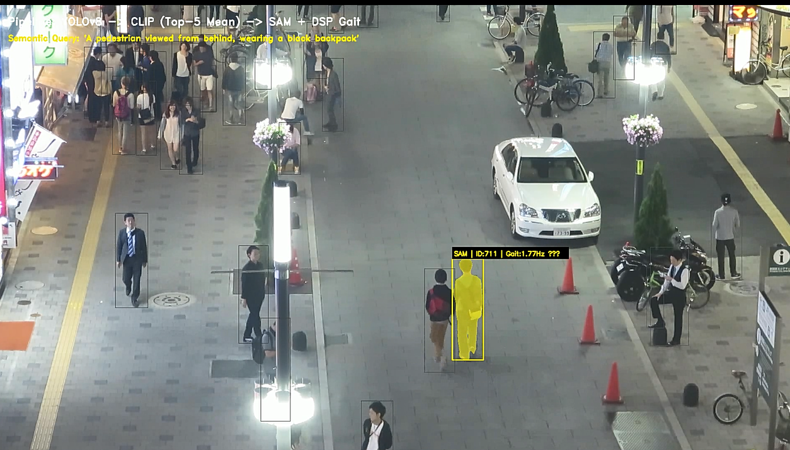
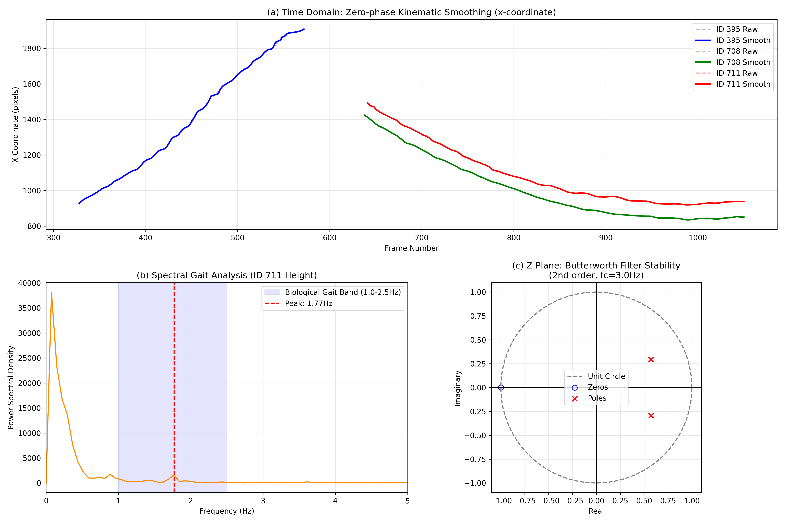

# 开放词汇多目标追踪系统

基于 **YOLOv8 → BoT-SORT (NSA Kalman) → CLIP → SAM** 的多模态行人追踪系统。给定一段自然语言描述（如"背着黑色背包的行人"），系统可在整段视频中完成目标检测、追踪、跨模态语义检索与像素级分割。

---

## PIPELINE总览

```
train.py              ← 在 MOT17 上微调 YOLOv8m 行人检测器
    ↓
apply_nsa_patch.py    ← 向 Ultralytics BoT-SORT 注入 NSA 自适应卡尔曼逻辑
    ↓
track_demo.py         ← 运行追踪 → 输出 MOT 格式结果(.txt) + 追踪视频
    ↓
clip_mot_search.py    ← 自然语言查询 → CLIP 跨模态检索匹配轨迹 ID
    ↓
render_demo.py        ← 渲染锁定目标的边界框标注视频
render_sam_demo.py    ← 渲染像素级 SAM 分割视频
    ↓
dsp_trajectory_analysis.py  ← DSP 分析：轨迹平滑 / 步态检测 / SNR 评估
evaluate_mot.py             ← 标准 MOT 指标评估：MOTA、IDF1 等
```

---

## 核心技术亮点

### 1. NSA 自适应卡尔曼滤波 (`apply_nsa_patch.py`)

在运行时将 **噪声分数自适应（NSA）卡尔曼**逻辑注入 Ultralytics 内置追踪器（无需 fork 仓库）。当检测置信度低时，创新协方差 `R` 被**动态放大**（`R = (1 - confidence) * R`），降低滤波器对噪声检测的信任度，提升轨迹 ID 一致性。

### 2. 跨模态语义检索 (`clip_mot_search.py`)

使用 OpenAI **CLIP (ViT-B/32)** 打通自然语言与轨迹外观之间的语义鸿沟：

- 对每条轨迹均匀采样最多 **20 帧**，覆盖更多角度与时段。
- 将每个裁剪的行人图块编码为 512 维特征向量。
- 同时编码**正向 Prompt**（背影+背包）和**负向 Prompt**（正面+手提包），计算**对抗评分**：`score = pos_sim − 0.4 × neg_sim`。
- 取各轨迹 **Top-5 帧均值**得分（防止单帧噪声误匹配）。
- 设置绝对阈值与相对门槛，**按需返回 1–3 条**匹配轨迹（视频里真正有几个就输出几个，不强行凑数）。

### 3. SAM 像素级分割 (`render_sam_demo.py`)

CLIP 定位目标轨迹 ID 后，**Meta Segment Anything Model (SAM ViT-B)** 以 **Butterworth 平滑后的边界框**作为 Prompt（坐标更稳定，减少抖动），逐帧生成像素精度的 Mask，视频上叠加荧光半透明分割效果，并在标签上实时显示步态检测频率（如 `Gait:1.77Hz ✓`）。

### 4. DSP 轨迹信号分析 (`dsp_trajectory_analysis.py`)

对原始追踪坐标应用三个信号处理模块：

- **模块 1** — 零相位二阶 Butterworth 低通滤波（截止频率 3 Hz）运动学平滑。
- **模块 2** — FFT 频谱步态分析：在边界框高度信号中检测生理步态频率峰值（1.0–2.5 Hz）。
- **模块 3** — 滑动窗口 SNR 评估；当 SNR 下降超过 3 dB 时，触发自适应 INSA 权重建议。

---

## 效果展示

### 追踪 + 语义锁定（边界框版）




---

### SAM 像素级分割效果


*基础模型流水线：YOLOv8 检测 → CLIP 检索 → SAM 逐帧像素分割，目标区域以黄色高亮叠加。*

---

### CLIP 语义检索输出

```
==================================================
Prompt: 'The back of a pedestrian walking away, backpack straps visible on shoulders, rear view'
 找到 3 条匹配轨迹（阈值 min=0.02, drop=0.03）：
   [1] 轨迹 ID: 711   对抗得分: 0.2139
   [2] 轨迹 ID: 1     对抗得分: 0.2044
   [3] 轨迹 ID: 352   对抗得分: 0.1984
==================================================
```

> 对抗得分 = 正向相似度 − 0.4 × 负向相似度；当视频中实际目标少于 3 个时，低于阈值的候选会被自动截断。

---

### DSP 轨迹分析仪表盘



三个子图说明：

- **(a) 时域平滑**：虚线为原始坐标，实线为零相位 Butterworth 滤波后的平滑轨迹（3 Hz 截止）。
- **(b) 频谱步态分析**：对 ID 711 的边界框高度做 FFT，蓝色区域（1.0–2.5 Hz）为生理步态频段，红色虚线为检测到的峰值频率。
- **(c) 滤波器零极点图**：验证 2 阶 Butterworth 滤波器所有极点均在单位圆内，系统稳定。

---

## 核心算法原理

### NSA 自适应卡尔曼滤波

标准卡尔曼的量测噪声协方差 `R` 是固定值，无法区分高置信度和低置信度检测帧。NSA 的改进：

```
R_nsa = (1 − confidence) × R_base

confidence → 1（检测可靠）：R → 0，滤波器完全信任量测，状态快速收敛
confidence → 0（检测模糊）：R → R_base，滤波器保守更新，依赖运动预测
```

效果：遮挡或模糊帧不再随意漂移 ID，ID 切换次数（IDS）明显减少。

---

### CLIP 对抗评分检索

普通 CLIP 只用单个正向 Prompt，容易把"手提包正面行人"和"背包背影行人"混淆（两者在 512 维特征空间距离较近）。对抗评分通过引入负向 Prompt 来推开误匹配方向：

```
score = TopK_mean( sim(图像, 正向Prompt) − α × sim(图像, 负向Prompt) )

正向：背影+肩带可见的背包
负向：正面行人+手提包/购物袋
α = 0.4，TopK = 5（多帧持续高分才命中，非单帧偶然）
```

自适应输出：绝对下限 `MIN_SCORE` + 相对截断 `REL_DROP`，视频里有几个真实目标就输出几个。

---

### 零相位 Butterworth 低通滤波

行人质心坐标的真实运动频率通常低于 1–2 Hz，检测框抖动噪声则分布在更高频段。二阶 Butterworth（截止 fc = 3 Hz）可有效分离二者：

```
归一化截止频率：Wn = fc / (fps/2) = 3/15 = 0.2
scipy.signal.filtfilt（前向 + 反向两次滤波）→ 零相位，无时延偏移
```

平滑后的坐标作为 SAM 的 Bounding Box Prompt，分割边界不再随检测抖动而闪烁。

---

### FFT 步态频率分析

人正常行走步频约为 **1.6–2.2 Hz**。边界框高度 `h[t]` 随步态周期性起伏，可通过 FFT 检测：

```
1. 对 h[t] 线性去趋势（去除摄像机距离变化引起的缓慢漂移）
2. 计算实数 FFT → 功率谱密度 PSD
3. 在生理步态频带 [1.0, 2.5] Hz 内寻找峰值频率 f_peak
4. 判定条件：PSD(f_peak) > 2 × 带外噪声基底均值
```

用**带外噪声基底**（而非全谱均值）做参考，避免强步态峰值自身拉高均值导致漏检。这在俯视监控低振幅步态场景下尤为重要。

---

## 文件结构

```
cv_project/
├── train.py                   # YOLOv8m 在 MOT17 上微调
├── apply_nsa_patch.py         # 向 Ultralytics 注入 NSA Kalman 逻辑
├── track_demo.py              # BoT-SORT 追踪 → MOT txt + 视频
├── clip_mot_search.py         # CLIP 自然语言查询 → Top-K 轨迹 ID
├── render_demo.py             # 为 CLIP 找到的目标渲染边界框视频
├── render_sam_demo.py         # SAM 像素级分割渲染视频
├── dsp_trajectory_analysis.py # DSP 分析仪表盘（生成 png 图表）
├── evaluate_mot.py            # MOTChallenge 标准指标评估
├── verify_id8.py              # 调试工具：裁剪并查看指定轨迹 ID 的外观
├── botsort_reid.yaml          # BoT-SORT 追踪器配置（调优后的阈值）
├── mot17.yaml                 # YOLOv8 数据集配置（MOT17）
└── target_ids.txt             # CLIP 输出：Top-3 匹配轨迹 ID
```

---

## 环境安装

```bash
# 创建虚拟环境
python3 -m venv venv && source venv/bin/activate

# 安装核心依赖
pip install ultralytics
pip install git+https://github.com/openai/CLIP.git
pip install git+https://github.com/facebookresearch/segment-anything.git
pip install scipy matplotlib tqdm motmetrics

# GPU：推荐 CUDA 11.8+（已在 RTX 4070 8GB 显存上测试）
```

### 需要手动下载的资源

| 资源               | 来源                                                                                     | 存放位置                 |
| ------------------ | ---------------------------------------------------------------------------------------- | ------------------------ |
| MOT17 数据集       | [motchallenge.net](https://motchallenge.net)                                                | `data/MOT17/`          |
| YOLO 格式标签      | 运行 `data/convert_mot17.py` 转换                                                      | `data/mot17_yolo/`     |
| YOLOv8m 预训练权重 | `ultralytics` 自动下载                                                                 | 项目根目录               |
| SAM ViT-B 权重     | [SAM 官方 Releases](https://github.com/facebookresearch/segment-anything#model-checkpoints) | `sam_vit_b_01ec64.pth` |

---

## 快速上手

### 第一步 — 微调检测器

```bash
python train.py
# 输出：runs/detect/yolov8m_mot17_finetune/weights/best.pt
```

### 第二步 — 注入 NSA Kalman（仅需执行一次）

```bash
python apply_nsa_patch.py
# 直接修改已安装的 ultralytics 库文件
```

### 第三步 — 运行追踪

```bash
python track_demo.py
# 输出：MOT17-04-results.txt  +  tracking_stable_demo.mp4
```

### 第四步 — 语义目标检索

修改 `clip_mot_search.py` 中的 `pos_prompt` / `neg_prompt`，然后运行：

```bash
python clip_mot_search.py
# 控制台输出匹配轨迹 ID 及对抗得分，自动保存：target_ids.txt
```

可调参数（脚本内直接修改）：

| 参数 | 默认值 | 说明 |
|---|---|---|
| `NEG_WEIGHT` | 0.4 | 负向惩罚系数，越大越严格排除误匹配 |
| `MIN_SCORE` | 0.02 | 对抗得分绝对下限，低于此值不输出 |
| `REL_DROP` | 0.03 | 与第一名的最大允许得分差距 |
| `MAX_RESULTS` | 3 | 最多输出条数 |

### 第五步 — 渲染结果视频

边界框标注版：

```bash
python render_demo.py
# 输出：multimodal_tracking_demo_V2.mp4
```

SAM 像素级分割版：

```bash
python render_sam_demo.py
# 输出：multimodal_sam_tracking.mp4（速度较慢，需要 GPU）
```

### 第六步 — DSP 轨迹分析（可选）

```bash
python dsp_trajectory_analysis.py
# 输出：dsp_analysis_dashboard.png
```

### 第七步 — MOT 指标评估（可选）

```bash
python evaluate_mot.py
# 输出：MOT17-04 的 MOTA、IDF1、ID 切换次数、精确率、召回率
```

> 将终端输出截图放在此处，命名建议：`docs/mot_eval_result.jpg`


---

## BoT-SORT 配置说明 (`botsort_reid.yaml`)

| 参数                  | 值            | 说明                                     |
| --------------------- | ------------- | ---------------------------------------- |
| `track_high_thresh` | 0.25          | 高置信度检测阈值（第一轮匹配）           |
| `track_low_thresh`  | 0.1           | 低置信度检测阈值（第二轮补救匹配）       |
| `track_buffer`      | 60            | 丢失轨迹保留帧数（30fps 下 = 2秒）       |
| `match_thresh`      | 0.8           | IoU + 外观融合匹配阈值                   |
| `gmc_method`        | sparseOptFlow | 全局运动补偿方法                         |
| `with_reid`         | False         | 关闭内置 Re-ID（由 CLIP 承担重识别功能） |

---

## 数据集说明：MOT17-04

所有脚本默认使用 **MOT17-04-FRCNN** 序列。切换序列时，需同步修改 `track_demo.py`、`clip_mot_search.py`、`render_demo.py`、`evaluate_mot.py` 中的路径。

期望的数据目录结构：

```
data/
└── MOT17/
    └── train/
        └── MOT17-04-FRCNN/
            ├── img1/          # 000001.jpg ... 001050.jpg
            └── gt/
                └── gt.txt     # 真值标注（MOT16 格式）
```

---

## 注意事项

- `apply_nsa_patch.py` 会直接修改**已安装**的 `ultralytics` 库。升级 ultralytics 后需重新运行一次。
- `clip_mot_search.py` 已内置 `libnvrtc` 缺失的绕过方案（通过 `torch.backends.cuda` 标志），CUDA < 12 环境下可正常运行。
- `render_sam_demo.py` 计算量较大：RTX 4070 处理 1080p 序列约 1–2 FPS，请预留足够时间。
